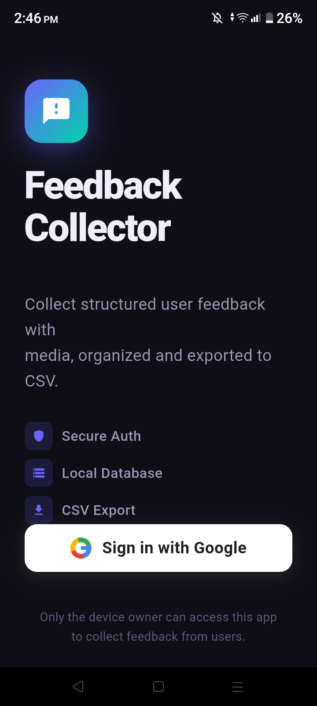
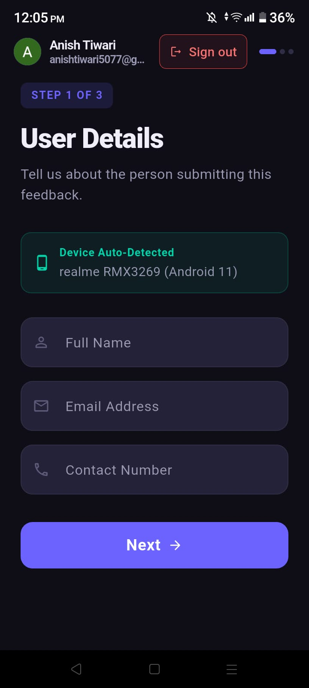
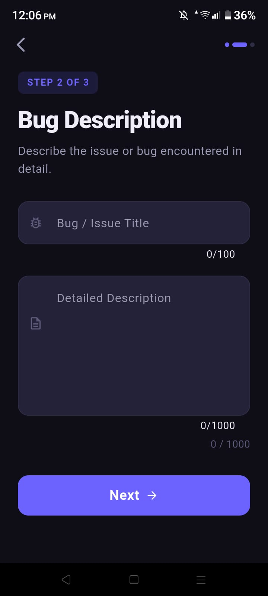
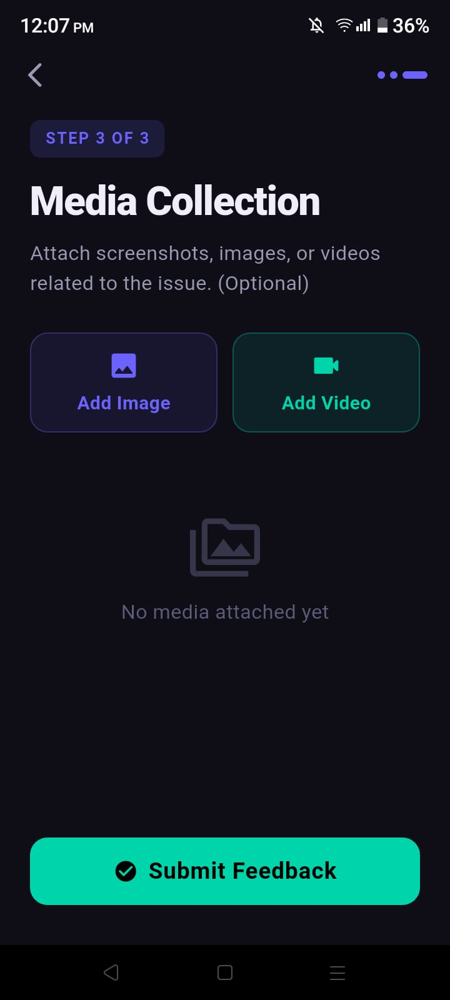
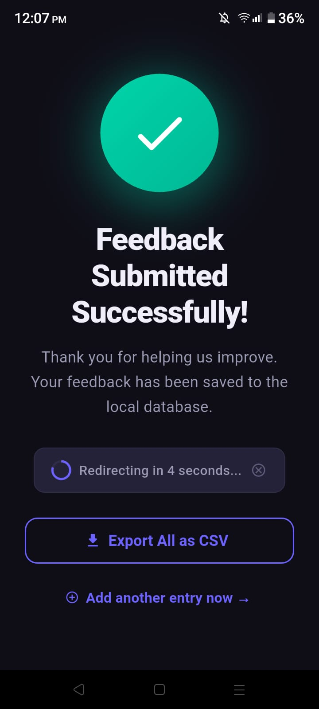
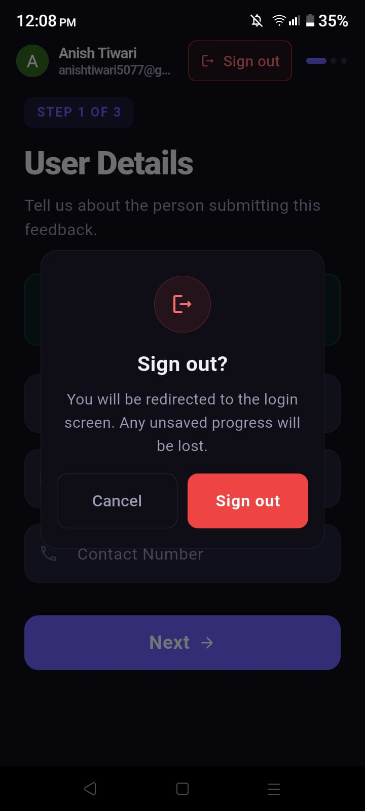
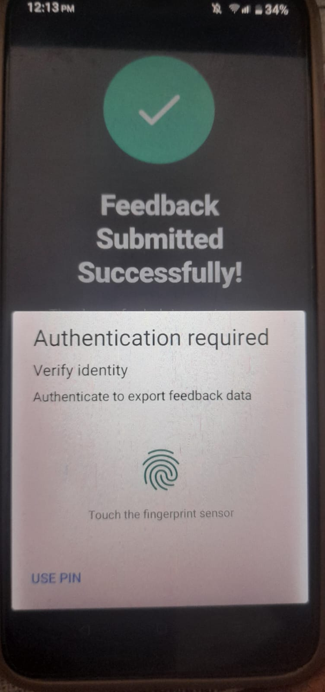
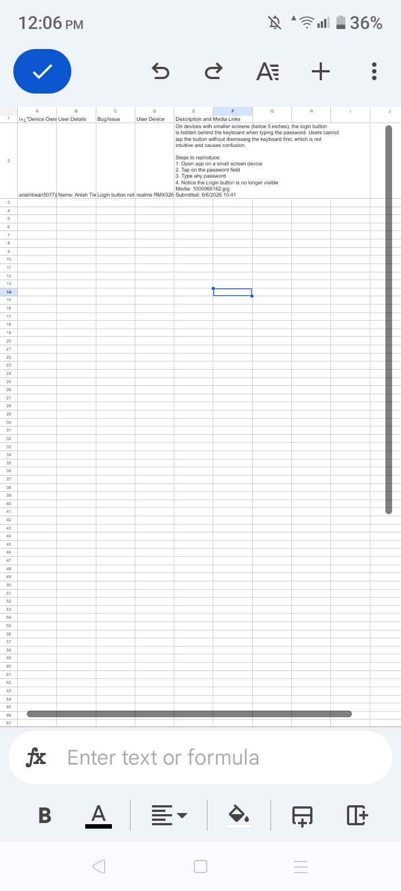
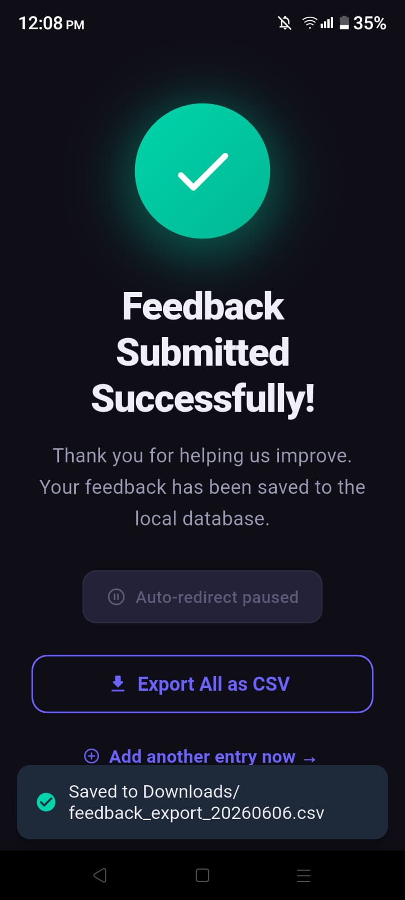

# Flutter User Feedback Application

> A structured, multi-screen feedback collection app built with Flutter — featuring Google Sign-In, BLoC state management, SQLite persistence, biometric-gated CSV export, and scoped storage for media.

---

## Table of Contents

- [Overview](#overview)
- [App Flow](#app-flow)
- [Features](#features)
- [Tech Stack](#tech-stack)
- [Architecture](#architecture)
- [Project Structure](#project-structure)
- [Getting Started](#getting-started)
  - [Prerequisites](#prerequisites)
  - [Firebase Setup](#firebase-setup)
  - [Run the App](#run-the-app)
- [CSV Export Format](#csv-export-format)
- [Database Schema](#database-schema)
- [Screenshots](#screenshots)
- [Screens](#screens)
- [Design Choices](#design-choices)
- [Challenges & Solutions](#challenges--solutions)
- [Potential Improvements](#potential-improvements)

---

## Overview

This app allows a **device owner** to authenticate via Google Sign-In and then collect structured feedback from users. Each feedback session captures user details, a bug/issue description, and optional media attachments. All data is stored locally in SQLite and can be securely exported as a CSV file — protected by biometric or PIN authentication.

---

## App Flow

```
┌─────────────────────┐
│  1. Google Login    │  Device owner authenticates via Google
└─────────┬───────────┘
          ↓
┌─────────────────────┐
│  2. User Details    │  Collect: Name · Email · Contact
│                     │  Device info auto-detected
└─────────┬───────────┘
          ↓
┌─────────────────────┐
│  3. Bug Description │  Bug/issue title + detailed description
└─────────┬───────────┘
          ↓
┌─────────────────────┐
│  4. Media Collection│  Attach screenshots / images / videos
└─────────┬───────────┘
          ↓
┌─────────────────────┐
│  5. Thank You       │  Success screen → auto-redirects to
│                     │  Screen 2 after 3 s for next entry
└─────────────────────┘
```

---

## Features

- 🔐 **Google Sign-In** via Firebase Authentication — only the device owner can access
- 📝 **Structured feedback** — name, email, contact, bug title, detailed description
- 📱 **Auto device detection** — model and Android version via `device_info_plus`
- 🖼️ **Media attachments** — pick images/videos from camera or gallery
- 🗄️ **Local SQLite database** — all feedback persisted offline
- 🔒 **Biometric / PIN gated export** — `local_auth` protects the CSV export
- 📤 **CSV export** — saved to the Downloads folder with exact assignment column format
- 🔄 **Auto-redirect** — Thank You screen redirects back to User Details to accept another entry
- 🎨 **Animated UI** — smooth transitions, focus-driven form field animations, step indicator

---

## Tech Stack

| Requirement | Package |
|---|---|
| State Management | `flutter_bloc` `^8.1.6` + `bloc` `^8.1.4` |
| Google Sign-In | `google_sign_in` `^6.2.2` |
| Firebase Auth | `firebase_auth` `^5.3.4` + `firebase_core` `^3.8.0` |
| Local SQL Database | `sqflite` `^2.4.0` |
| Dependency Injection | `get_it` `^8.0.3` |
| Media Picker | `image_picker` `^1.1.2` |
| Storage Permissions | `permission_handler` `^11.3.1` |
| CSV Generation | `csv` `^6.0.0` |
| Biometric Auth | `local_auth` `^2.3.0` |
| Navigation | `go_router` `^14.6.2` |
| Animations | `animations` `^2.0.11` |
| Device Info | `device_info_plus` `^13.1.0` |
| Temp File Access | `path_provider` `^2.1.5` |
| BLoC Equality | `equatable` `^2.0.5` |

---

## Architecture

All UI reacts to **BLoC-managed events and state** — no business logic lives in widgets.

```
UI Widget
  │── dispatches Event ──▶ BLoC
  │                          │── emits State ──▶ UI rebuilds
  │
  └── reads State via BlocBuilder / BlocListener
```

A shared **`FeedbackCubit`** accumulates form data across screens. It is committed to the database only on the final Submit (Screen 4), so partial entries are never written.

| Screen | BLoC | Responsibility |
|---|---|---|
| Login | `AuthBloc` | Google sign-in, auth state management |
| User Details | `UserDetailsBloc` | Form validation, field state |
| Bug Description | `BugBloc` | Text input, char counter, validation |
| Media Collection | `MediaBloc` | File pick, removal, path tracking |
| Export (Thank You) | `ExportBloc` | Biometric auth + CSV generation |

---

## Project Structure

```
lib/
├── core/
│   ├── constants/
│   │   └── app_constants.dart
│   ├── database/
│   │   └── database_service.dart      # Dedicated SQLite service layer
│   ├── di/
│   │   └── injection.dart             # get_it dependency injection
│   ├── models/
│   │   └── feedback_model.dart
│   ├── router/
│   │   └── app_router.dart
│   └── theme/
│       └── app_theme.dart
├── features/
│   ├── auth/
│   │   ├── bloc/                      # AuthBloc, AuthEvent, AuthState
│   │   └── screens/
│   │       └── login_screen.dart      # Screen 1
│   ├── user_details/
│   │   ├── bloc/                      # UserDetailsBloc
│   │   └── screens/
│   │       └── user_details_screen.dart  # Screen 2
│   ├── bug_description/
│   │   ├── bloc/                      # BugBloc
│   │   └── screens/
│   │       └── bug_description_screen.dart  # Screen 3
│   ├── media_collection/
│   │   ├── bloc/                      # MediaBloc
│   │   └── screens/
│   │       └── media_collection_screen.dart  # Screen 4
│   ├── thank_you/
│   │   └── screens/
│   │       └── thank_you_screen.dart  # Screen 5
│   ├── export/
│   │   ├── bloc/                      # ExportBloc
│   │   └── services/
│   │       └── csv_export_service.dart
│   └── feedback_cubit/
│       └── feedback_cubit.dart        # Shared cross-screen cubit
└── main.dart
```

---

## Getting Started

### Prerequisites

- Flutter SDK `>=3.5.0`
- Android device or emulator (API 26+)
- A Firebase project with Google Sign-In enabled
- Java 17+ for Gradle builds

### Firebase Setup

1. Create a Firebase project at [console.firebase.google.com](https://console.firebase.google.com)
2. Add an **Android app** with your package name (`com.example.feedback_app`)
3. Download `google-services.json` and place it in `android/app/`
4. Enable **Google Sign-In** in Authentication → Sign-in method
5. The `firebase_options.dart` is already configured — replace it with your own if using a different Firebase project

### Run the App

```bash
# Install dependencies
flutter pub get

# Run on connected device
flutter run

# Build release APK
flutter build apk --release
```

> **Note:** Portrait orientation is locked at runtime. The app targets Android only.

---

## CSV Export Format

The exported CSV uses the following exact columns:

| Device Owner | User Details | Bug/Issue | User Device | Description and Media Links |
|---|---|---|---|---|
| Google account email of the authenticated device owner | `Name \| Email \| Contact` | Bug title / issue summary | Device model + Android OS version | Full description + `\| Media: <URIs or None>` |

The CSV is saved to the device **Downloads** folder as `feedback_export.csv`.  
Export is gated behind **biometric or PIN authentication** via `local_auth`.

---

## Database Schema

```sql
CREATE TABLE feedback (
  id           INTEGER PRIMARY KEY AUTOINCREMENT,
  device_owner TEXT NOT NULL,
  name         TEXT NOT NULL,
  email        TEXT NOT NULL,
  contact      TEXT NOT NULL,
  bug_issue    TEXT NOT NULL,
  user_device  TEXT,
  description  TEXT NOT NULL,
  media_links  TEXT,
  created_at   TEXT NOT NULL
);
```

---

## Screenshots

> Save your screenshots in the `screenshots/` folder using the filenames below, then commit them.

### App Screens

<table>
  <tr>
    <td align="center"><b>1 · Login</b></td>
    <td align="center"><b>2 · User Details</b></td>
    <td align="center"><b>3 · Bug Description</b></td>
    <td align="center"><b>4 · Media Collection</b></td>
  </tr>
  <tr>
    <td></td>
    <td></td>
    <td></td>
    <td></td>
  </tr>
  <tr>
    <td align="center"><b>5 · Thank You</b></td>
    <td align="center"><b>6 · Sign Out Dialog</b></td>
    <td align="center"><b>7 · Extra / Other</b></td>
    <td align="center"><b>CSV Export Output</b></td>
  </tr>
  <tr>
    <td></td>
    <td></td>
    <td></td>
    <td></td>
  </tr>
  <tr>
    <td align="center" colspan="4"><b>9 · Additional</b></td>
  </tr>
  <tr>
    <td align="center" colspan="4"></td>
  </tr>
</table>

---

## Screens

| # | Screen | Key Details |
|---|---|---|
| 1 | **Google Login** | Animated logo, Google OAuth via Firebase, session persisted |
| 2 | **User Details** | Name · Email · Contact fields with validation; device auto-detected |
| 3 | **Bug Description** | Issue title + multiline description with character counter |
| 4 | **Media Collection** | Pick from camera or gallery; thumbnail grid with remove; optional |
| 5 | **Thank You** | Animated checkmark; 5-second countdown with cancel; CSV export button |

---

## Design Choices

- **BLoC over Riverpod/Provider** — the assignment specifically required `flutter_bloc` for state management.
- **sqflite over Hive** — the assignment specified using a "local SQL database".
- **get_it for DI** — the assignment specifically mentioned using `get_it`.
- **permission_handler + direct file write** — provides a reliable way to save to the Downloads folder (Scoped Storage) without complex media store APIs that can fail on newer Android versions.
- **Biometric Authentication** — Implemented biometric (fingerprint/password) authentication using the `local_auth` package to secure the CSV export as required.
- **Features-first folder structure** — scales well and keeps each screen's UI and BLoC logic completely self-contained.

---

## Challenges & Solutions

| Challenge | Solution |
|---|---|
| BLoC state shared across 5 screens | `FeedbackCubit` accumulates form data across all screens; committed to SQLite only on final Submit (Screen 4) |
| Scoped storage varies by Android API | `permission_handler` + direct `File` write to `/storage/emulated/0/Download` handles API 29+ reliably |
| Biometric not available on all devices | `biometricOnly: false` in `local_auth` allows PIN/password fallback automatically |
| CSV special characters (commas, newlines) | `ListToCsvConverter` from the `csv` package handles all escaping and quoting |
| Auto-redirect from Thank You → Screen 2 | `Timer.periodic` with a live countdown; cancelled if user taps Export or Add Entry |
| Context-dependent calls across async gaps | All `context.read<>()` refs captured before `await` to prevent use-after-dispose errors |
| RenderFlex overflow on small screens | Wrapped login body in `CustomScrollView` + `SliverFillRemaining` to handle tight viewports |

---

## Potential Improvements

1. **Firebase Firestore backup** — cloud sync of all feedback records
2. **Analytics dashboard** — charts showing bugs by severity / device / date
3. **PDF export** — generate a formatted PDF alongside the CSV
4. **Multiple device owners** — role-based access control
5. **Offline queue** — collect feedback offline, sync when connected
6. **Search & filter** — filter the feedback list by date, severity, or device
7. **Unit + Widget tests** — full BLoC unit tests and screen widget tests
8. **Export history** — log of all previous CSV exports with timestamps

---

**Author:** Anish Tiwari — Flutter Developer  
**Email:** anishtiwari5077@gmail.com  
**GitHub:** [github.com/AnishTiwari5077](https://github.com/AnishTiwari5077)